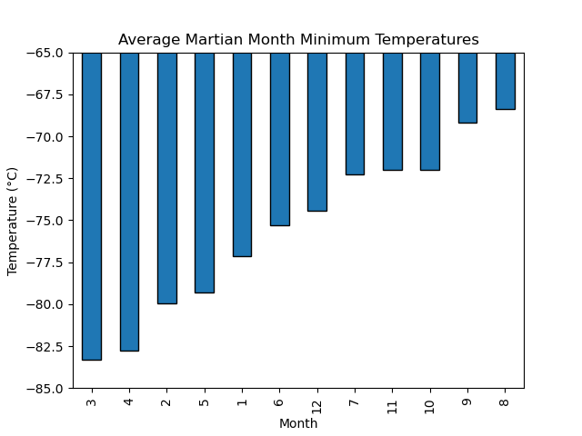

## Module 11 Challenge, 31 August 2023, Web Scraping

Development on this project has stopped.

## Description

This project scrapes the web for two different deliverables.

Deliverable 1 scrapes titles and preview text from a [website](https://static.bc-edx.com/data/web/mars_news/index.html) about Martian news articles.

Deliverable 2 scrapes and analyzes Martian weather data from a table on a [website](https://static.bc-edx.com/data/web/mars_facts/temperature.html), drawn from the Curiosity rover.

## Usage

You can view the recent results in `part_1_mars_news.ipynb` and `part_2_mars_weather.ipynb`, located in the repository root. If you want to run the code, restart the kernel and 'run all'.

## Gallery of Results:

Bar plot of Average Martian Minimum Temperatures by Month:

Bar plot of Average Martian Pressure by Month:

Minimum Temperature by Day on Earth:

## Acknowledgments

Thanks to Geronimo Perez for feedback and assistance

## Author

Bryan Johns, August, 2023
