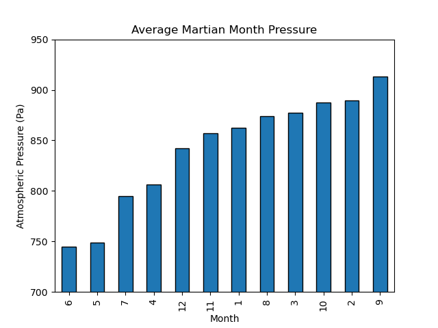

## Module 11 Challenge, 31 August 2023, Web Scraping

Development on this project has stopped.

## Description

This project scrapes the web for two different deliverables.

Deliverable 1 scrapes titles and preview text from the [Mars News website](https://static.bc-edx.com/data/web/mars_news/index.html) about Martian news articles. Results are exported to `mars_news.json`.

Deliverable 2 scrapes and analyzes Martian weather data from a table on [Mars Temperature Data](https://static.bc-edx.com/data/web/mars_facts/temperature.html), drawn from NASA's Curiosity rover. The data is analyzed to answer some basic questions about Martian weather. Results are summarized near the end of the notebook. Data is exported to `martian_weather.csv`.

## Usage

You can view the results in `part_1_mars_news.ipynb` and `part_2_mars_weather.ipynb`, located in the repository root. If you want to run the code, restart the kernel and 'run all'.

## Gallery of Results:

### Deliverable 1:

Mars news articles:

### Deliverable 2:

Bar plot of Average Martian Minimum Temperatures by Month:

Bar plot of Average Martian Pressure by Month:

Minimum Temperature by Day on Earth:

## References

The most recent Curiosity rover weather data can be accessed at [Mars Weather | Curiosity](https://mars.nasa.gov/msl/weather/)

The [Mars News website](https://static.bc-edx.com/data/web/mars_news/index.html) is operated by edX Boot Camps LLC for educational purposes only. The news article titles, summaries, dates, and images were scraped from [NASA's Mars News](https://mars.nasa.gov/) website in November 2022. Images are used according to the [JPL Image Use Policy](https://www.jpl.nasa.gov/jpl-image-use-policy), courtesy NASA/JPL-Caltech.

## Acknowledgments

Thanks to Geronimo Perez for feedback and assistance

## Author

Bryan Johns, August, 2023
